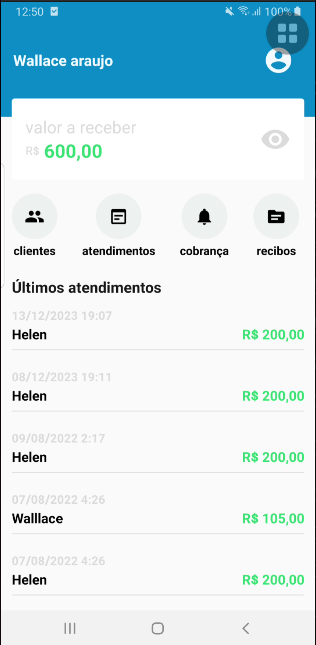
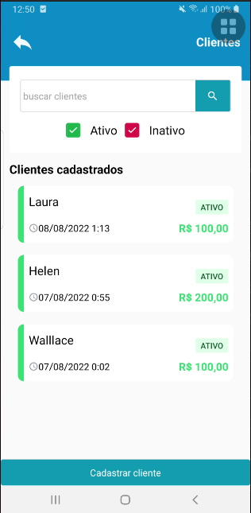
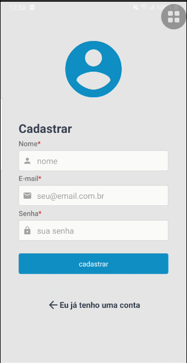
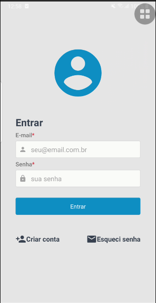
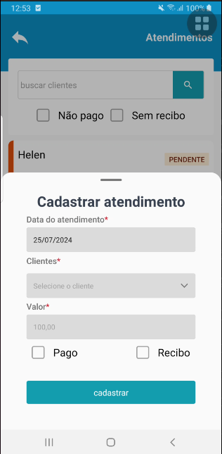
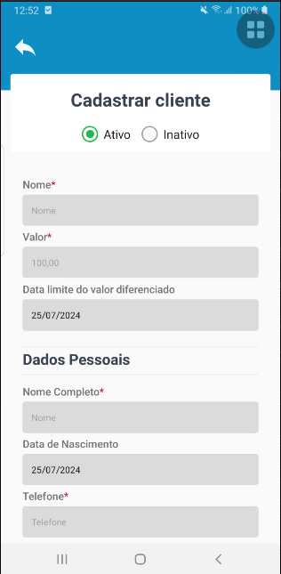
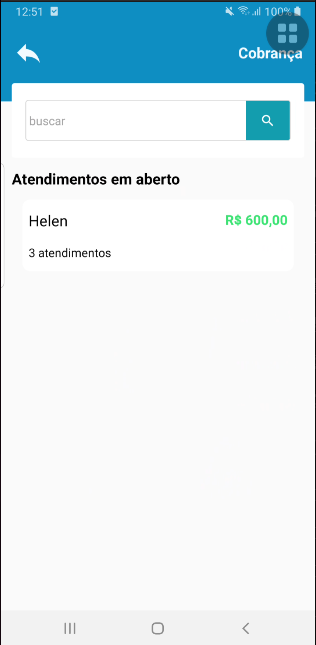
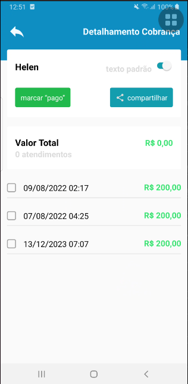
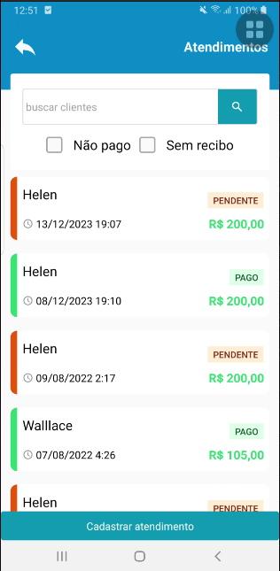
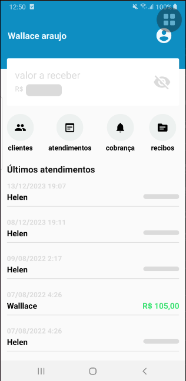

# App de Controle de Atendimentos para Psicólogos

## Descrição
Este é um aplicativo desenvolvido em React Native para auxiliar profissionais de psicologia no controle de atendimentos. O app oferece funcionalidades para acompanhamento de pacientes, lembretes, cobranças e controle financeiro.

## Funcionalidades
- Acompanhamento de pacientes
- Agendamento de consultas
- Lembretes de consultas
- Cobrança de consultas
- Controle financeiro

## Tecnologias Utilizadas
- React Native
- Expo
- Bibliotecas adicionais: descreva aqui qualquer outra biblioteca que esteja utilizando

## Instalação
Para rodar este projeto localmente, siga os passos abaixo:

1. **Clone o repositório:**
    ```bash
    git clone 
    ```
2. **Navegue até o diretório do projeto:**
    ```bash
    cd nome-do-repositorio
    ```
3. **Instale as dependências:**
    ```bash
    yarn install
    ```
4. **Inicie o servidor de desenvolvimento com Expo:**
    ```bash
    yarn start
    ```

## Uso
Depois de iniciar o servidor, você pode abrir o aplicativo no seu dispositivo móvel usando o aplicativo Expo Go, disponível na App Store e Google Play Store. Escaneie o QR code fornecido pelo servidor de desenvolvimento para abrir o aplicativo.

## Prints da Aplicação
Aqui estão alguns prints da aplicação para demonstrar suas funcionalidades:

1. 
2. 
3. 
4. 
5. 
6. 
7. 
8. 
9. 
10. 

